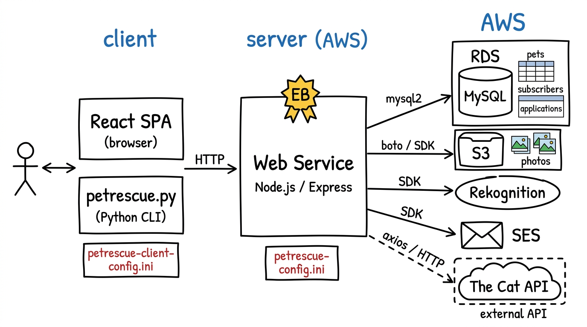

# Animal Rescue Hub

**CS 310 — Scalable Software Architectures**  
**Winter 2026 — Final Project**  
**Student: Xinyue Zhang**

---

## Project Overview

Animal Rescue Hub is a cloud-native web service designed to help small animal rescue organizations increase visibility and connect adoptable animals with potential adopters. The project was inspired by Paws and Claws Cat Rescue in Evanston, Illinois.

The application supports two user roles:
- **Rescue staff** — upload animal photos and create listings
- **Visitors** — browse animals, subscribe to alerts, and submit adoption applications

---

## System Architecture

The application follows a **multi-tier architecture** consisting of a client tier, a server tier, and a backend services tier.

**Client tier** (left side of diagram):  
There are two clients. The primary client is a React single-page application (SPA) served directly by the Express web service, which users open in a browser at `http://localhost:8080`. A secondary Python command-line client (`petrescue.py`) is also provided for scripted testing. Both clients communicate with the server exclusively via HTTP requests carrying JSON payloads. Configuration for the Python client is stored in `petrescue-client-config.ini`.

**Server tier** (center of diagram):  
The web service is built with Node.js and Express, deployed on AWS Elastic Beanstalk. It is the entry point for all client requests and is responsible for all business logic. AWS credentials and API keys are stored in `petrescue-config.ini` on the server and never exposed to the client. Each API endpoint is implemented in its own JavaScript file for modularity.

**Backend services tier** (right side of diagram):  
The server connects to four AWS services and one external API:
- **Amazon RDS (MySQL)** — stores all persistent data across three tables: `pets` (rescue animal listings), `subscribers` (email alert subscribers), and `applications` (adoption applications). The server uses `mysql2/promise` with async/await and `p-retry` for resilient database access.
- **Amazon S3** — stores pet photos uploaded by rescue staff. Each photo is assigned a UUID-based key and retrieved on demand as a base64-encoded string.
- **AWS Rekognition** — called via the AWS SDK v3 `DetectLabels` API whenever a new pet photo is uploaded. It returns a ranked list of detected labels which the server uses to automatically populate the `species` field in the database.
- **Amazon SES** — sends two types of transactional emails: new-pet alert emails to all subscribers when a listing is created, and adoption confirmation emails to applicants when they submit an application.
- **The Cat API** (external, dashed border) — a free third-party REST API at `thecatapi.com`. The server calls it on demand via `axios` to fetch live cat breed information including photos, descriptions, temperament, and trait ratings. No data from this API is stored in our database.

---

## API Description

All endpoints accept and return JSON. The base URL is `http://localhost:8080`.

### GET /ping
Returns the number of photos in S3 (M) and pets in the database (N). Used as a health check.

| | |
|---|---|
| **Parameters** | None |
| **Response 200** | `{ "message": "success", "M": 12, "N": 6 }` |
| **Response 500** | `{ "message": "error message", "M": -1, "N": -1 }` |

---

### GET /external_pets — *Non-Trivial #1*
Fetches live cat breed data from The Cat API in real time. The server calls the external API, transforms the response, and returns it to the client.

| | |
|---|---|
| **Query params** | `limit` — number of breeds to return (default: 10, max: 25) |
| **Response 200** | `{ "message": "success", "count": 10, "pets": [ { "external_id", "image_url", "name", "breed", "description", "life_span", "temperament", "intelligence", "affection_level", "energy_level", "source": "external" } ] }` |
| **Response 500** | `{ "message": "error message", "pets": [] }` |

---

### GET /pets
Returns all rescue-added pets stored in the database, ordered by most recently added.

| | |
|---|---|
| **Parameters** | None |
| **Response 200** | `{ "message": "success", "count": 3, "pets": [ { "petid", "name", "species", "breed", "age_years", "description", "photo_key", "source", "created_at" } ] }` |

---

### POST /listing — *Non-Trivial #2*
Adds a rescue pet listing. Uploads the photo to S3, calls Rekognition to auto-detect the species, saves the record to MySQL, and emails all subscribers via SES.

| | |
|---|---|
| **Request body** | `{ "name": "Buddy", "breed": "Golden Retriever", "age_years": 4.0, "description": "...", "data": "<base64 JPEG>" }` |
| **Response 200** | `{ "message": "success", "petid": 7, "species": "dog", "rekognition_labels": [ { "name": "Dog", "confidence": 99.1 } ], "subscribers_emailed": 2 }` |
| **Response 400** | `{ "message": "name and data are required" }` |
| **Response 500** | `{ "message": "error message" }` |

---

### GET /image/:petid
Downloads a pet's photo from S3 and returns it as a base64-encoded string.

| | |
|---|---|
| **URL param** | `petid` — the pet's database ID |
| **Response 200** | `{ "message": "success", "petid": 7, "data": "<base64 string>" }` |
| **Response 400** | `{ "message": "no such petid", "petid": -1 }` |

---

### POST /subscribe
Adds an email address to the subscribers table to receive new-pet alert emails.

| | |
|---|---|
| **Request body** | `{ "email": "you@example.com" }` |
| **Response 200** | `{ "message": "success", "subid": 3 }` |
| **Response 200** | `{ "message": "already subscribed", "subid": -1 }` |

---

### POST /apply/:petid — *Non-Trivial #3*
Submits an adoption application for a specific rescue pet. Inserts the record into MySQL and sends a personalized SES confirmation email to the applicant.

| | |
|---|---|
| **URL param** | `petid` — the pet's database ID |
| **Request body** | `{ "applicant_name": "Jane Doe", "applicant_email": "jane@example.com", "message": "I have a large backyard..." }` |
| **Response 200** | `{ "message": "success", "appid": 5, "petid": 7, "email_sent": true }` |
| **Response 400** | `{ "message": "no such petid" }` |
| **Response 500** | `{ "message": "error message" }` |

---

## Database Schema

**Database name:** `petrescue` on Amazon RDS (MySQL)

### Table: `pets`

| Column | Type | Notes |
|---|---|---|
| `petid` | INT, AUTO_INCREMENT, PK | Unique pet ID |
| `name` | VARCHAR(100), NOT NULL | Pet's name |
| `species` | VARCHAR(50) | Auto-filled by Rekognition (cat, dog, bird…) |
| `breed` | VARCHAR(100) | Entered by staff |
| `age_years` | FLOAT | Age in years |
| `description` | TEXT | Free-text description |
| `photo_key` | VARCHAR(255) | S3 object key |
| `source` | VARCHAR(20) | Always `'rescue'` for staff-uploaded pets |
| `created_at` | TIMESTAMP | Auto-set on insert |

### Table: `subscribers`

| Column | Type | Notes |
|---|---|---|
| `subid` | INT, AUTO_INCREMENT, PK | Unique subscriber ID |
| `email` | VARCHAR(200), UNIQUE | Subscriber's email address |
| `created_at` | TIMESTAMP | Auto-set on insert |

### Table: `applications`

| Column | Type | Notes |
|---|---|---|
| `appid` | INT, AUTO_INCREMENT, PK | Unique application ID |
| `petid` | INT, FK → pets.petid | Which pet was applied for |
| `applicant_name` | VARCHAR(200) | Applicant's full name |
| `applicant_email` | VARCHAR(200) | Applicant's email |
| `message` | TEXT | Applicant's personal message |
| `created_at` | TIMESTAMP | Auto-set on insert |
